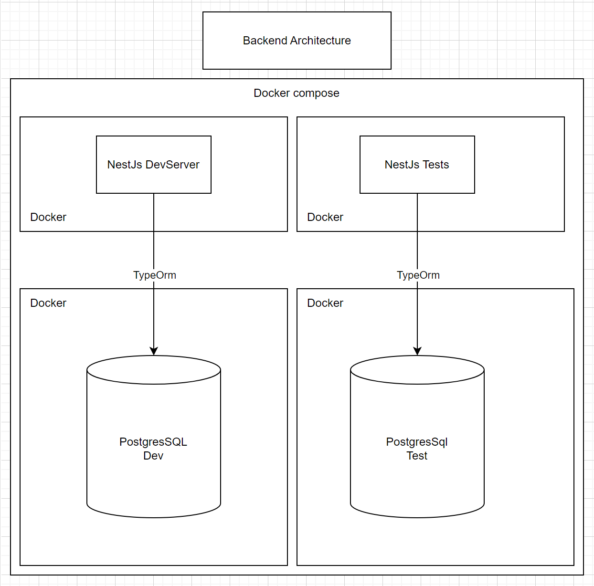

# Global architecture

I approach this backend test as a backend for a Dapp.  
The goal is to index in real-time DAI transactions.  
The project is made for run on local with postgres in docker.

The architecture is the next one:

NestJs is a concise framework for backend javascript, which force the use of typescript. Typescript is a big plus to avoid type error and some runtime problems. With typeOrm and a Repository abstraction we can use nestJS with Controller, Service, Repository pattern to keep a very clean code and architecture.

My though about the project, was to build the first brick of a dApp. Indexing some DAI transaction to link them later with userProfile, wallet, maybe game or more complex interactions. So I choose as relational database PostgresSql. This technology can assure us the global shape of the data and the current values stored in it.

In the case of the need is to do a transaction indexer to allow more flexible queries than on the chain, I think the focus should be on data storage in any condition for any datashape. So a NoSQL solution as Mongodb should be a good approach.

The test are based on jest and we have a mix between unit and integration tests.
Simple logs are stored in the database to keep track of requests on the server.
